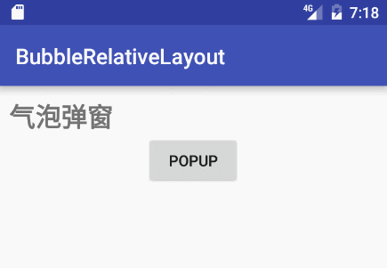

# BubbleView for Android

[](https://travis-ci.org/cpiz/BubbleView) [](https://jitpack.io/#cpiz/BubbleView)


[中文版README](README_CN.md)

BubbleView is a control/container with an arrow for Android, which can be fully customized by code or XML layout file.

* Arrow direction: up, down, left, right or none
* Should arrow auto point to its target
* Customizable arrow properties: size and location
* Customizable bubble properties: color, padding, borders and corner radius
* Bubble can be plain text view(BubbleTextView) or layout container(BubbleXxxLayout)

Download
--------
Add `maven { url "https://jitpack.io" }` to your project-level `build.gradle`
```
allprojects {
    repositories {
        ...
        maven { url "https://jitpack.io" }
    }
}
```

Add `compile 'com.github.cpiz:BubbleView:{X.Y.Z}'` to your module-level `build.gradle`(see X.Y.Z in [Releases](https://github.com/cpiz/BubbleView/releases))
```
dependencies {
    ...
    compile 'com.github.cpiz:BubbleView:{X.Y.Z}'
}
```

Specify the direction of arrow
--------
You can use app:bb_arrowDirection attribute to specify the direction of arrow. Its value can be: Left, Up, Right, Down or None. Arrow will be placed in the middle of the corresponding edge of bubble.


```XML
<com.cpiz.android.bubbleview.BubbleTextView
    android:id="@+id/bb1"
    android:layout_width="wrap_content"
    android:layout_height="wrap_content"
    android:layout_centerVertical="true"
    android:layout_toLeftOf="@id/iv1"
    android:padding="6dp"
    android:text="ArrowRight"
    android:textColor="@android:color/white"
    app:bb_arrowDirection="Right"
    app:bb_cornerRadius="4dp"/>
```

Point arrow to a specific target
-------
You can use app:bb_arrowTo attribute to specify the id of target view. The direction of arrow will be calculated automatically and it will point to the center of target.


```XML
<RelativeLayout
    android:id="@+id/group2"
    android:layout_width="match_parent"
    android:layout_height="180dp"
    android:layout_marginBottom="30dp"
    android:background="#bdc3c7"
    android:padding="10dp">

    <ImageView
        android:id="@+id/iv2"
        android:layout_width="wrap_content"
        android:layout_height="wrap_content"
        android:layout_centerHorizontal="true"
        android:layout_centerVertical="true"
        android:layout_margin="4dp"
        android:src="@android:drawable/ic_btn_speak_now"
        android:tint="#FFFFFF"/>

    <com.cpiz.android.bubbleview.BubbleTextView
        android:layout_width="wrap_content"
        android:layout_height="wrap_content"
        android:layout_alignTop="@id/iv2"
        android:layout_toLeftOf="@id/iv2"
        android:padding="6dp"
        android:text="Get your apps ready for Android 6.0 Marshmallow! "
        android:textColor="@android:color/white"
        app:bb_arrowTo="@id/iv2"/>
</RelativeLayout>
```

Customize style
-------


```XML
<com.cpiz.android.bubbleview.BubbleTextView
    android:id="@+id/big4"
    android:layout_width="wrap_content"
    android:layout_height="wrap_content"
    android:layout_below="@+id/big2"
    android:layout_margin="4dp"
    android:layout_toRightOf="@id/big3"
    android:padding="30dp"
    android:text="WithBorder"
    android:textColor="@android:color/white"
    app:bb_arrowDirection="Down"
    app:bb_arrowHeight="10dp"
    app:bb_arrowOffset="30dp"
    app:bb_arrowWidth="40dp"
    app:bb_borderColor="@color/colorPrimary"
    app:bb_borderWidth="6dp"
    app:bb_cornerBottomLeftRadius="0dp"
    app:bb_cornerBottomRightRadius="10dp"
    app:bb_cornerTopLeftRadius="0dp"
    app:bb_cornerTopRightRadius="4dp"
    app:bb_fillColor="@android:color/holo_red_light"
    app:bb_fillPadding="4dp"/>
```

###Use it as layout container
--------
Beside using BubbleTextView to display text, you can also use

* BubbleRelativeLayout
* BubbleLinearLayout
* BubbleFrameLayout

as bubble layout container and put customized content into it.


###Popup
--------
Can use BubblePopupWindow to wrap bubble, and show as popup.


* Support touch outside to close
* Support touch inside to close
* Support close in time

```
    View rootView = LayoutInflater.from(this).inflate(R.layout.simple_text_bubble, null);
    BubbleTextView bubbleView = (BubbleTextView) rootView.findViewById(R.id.popup_bubble);
    window = new BubblePopupWindow(rootView, bubbleView);
    window.setCanceledOnTouch(true);
    window.setCanceledOnTouchOutside(true);
    window.setCanceledOnLater(3000);
    window.showArrowTo(v, BubbleStyle.ArrowDirection.Left);
```

###Misc.

* Invoke methods like setBackground/setBackgroundColor of BubbleView will make the style settings invalid.

License
-------
	Copyright 2016 Cpiz

    Licensed under the Apache License, Version 2.0 (the "License");
    you may not use this file except in compliance with the License.
    You may obtain a copy of the License at

       http://www.apache.org/licenses/LICENSE-2.0

    Unless required by applicable law or agreed to in writing, software
    distributed under the License is distributed on an "AS IS" BASIS,
    WITHOUT WARRANTIES OR CONDITIONS OF ANY KIND, either express or implied.
    See the License for the specific language governing permissions and
    limitations under the License.
