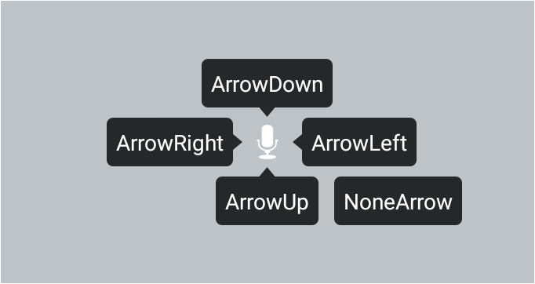
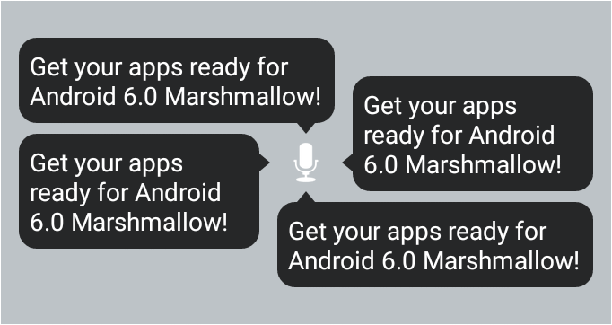
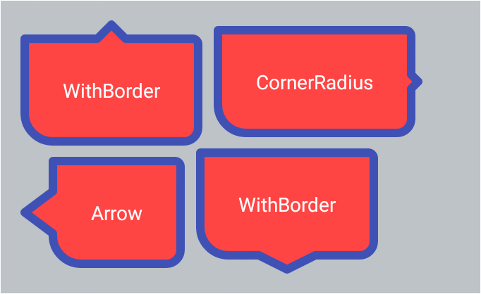
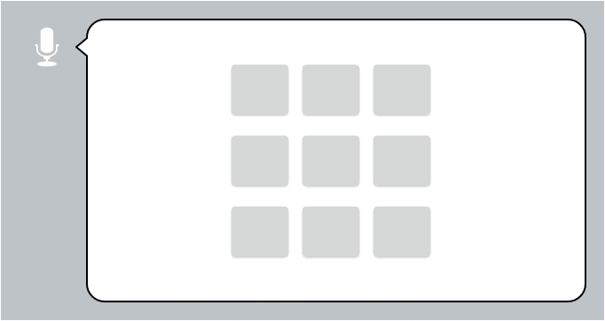

# BubbleView


##English

BubbleView is a control/container with an arrow, which can be fully customized by following attributes in layout file.

* Arrow direction: up, down, left, right or none
* Should arrow auto point to its target
* Size and position of arrow
* Filling color and padding of bubble
* Frame size and color of bubble
* Rounded corners and their radius
* Bubble can be plain text view(BubbleTextView) or layout container(BubbleXxxLayout)


Specify the direction of arrow
--------
You can use app:bb_arrowDirection attribute to specify the direction of arrow. It's value can be: Left, Up, Right, Down or None. Arrow will be placed in the middle of the corresponding edge of bubble.



```XML
<com.cpiz.android.bubbleview.BubbleTextView
    android:id="@+id/bb1"
    android:layout_width="wrap_content"
    android:layout_height="wrap_content"
    android:layout_centerVertical="true"
    android:layout_toLeftOf="@id/iv1"
    android:padding="6dp"
    android:text="ArrowRight"
    android:textColor="@android:color/white"
    app:bb_arrowDirection="Right"
    app:bb_cornerRadius="4dp"/>
```

Point arrow to a specific target
-------
You can use app:bb_arrowTo attribute to specify the id of target view. The direction of arrow will be calculated automatically and it will point to the center of target.



```XML
<RelativeLayout
    android:id="@+id/group2"
    android:layout_width="match_parent"
    android:layout_height="180dp"
    android:layout_marginBottom="30dp"
    android:background="#bdc3c7"
    android:padding="10dp">

    <ImageView
        android:id="@+id/iv2"
        android:layout_width="wrap_content"
        android:layout_height="wrap_content"
        android:layout_centerHorizontal="true"
        android:layout_centerVertical="true"
        android:layout_margin="4dp"
        android:src="@android:drawable/ic_btn_speak_now"
        android:tint="#FFFFFF"/>

    <com.cpiz.android.bubbleview.BubbleTextView
        android:layout_width="wrap_content"
        android:layout_height="wrap_content"
        android:layout_alignTop="@id/iv2"
        android:layout_toLeftOf="@id/iv2"
        android:padding="6dp"
        android:text="Get your apps ready for Android 6.0 Marshmallow! "
        android:textColor="@android:color/white"
        app:bb_arrowTo="@id/iv2"/>
</RelativeLayout>
```


Customize style
-------


```XML
<com.cpiz.android.bubbleview.BubbleTextView
    android:id="@+id/big4"
    android:layout_width="wrap_content"
    android:layout_height="wrap_content"
    android:layout_below="@+id/big2"
    android:layout_margin="4dp"
    android:layout_toRightOf="@id/big3"
    android:padding="30dp"
    android:text="WithBorder"
    android:textColor="@android:color/white"
    app:bb_arrowDirection="Down"
    app:bb_arrowHeight="10dp"
    app:bb_arrowOffset="30dp"
    app:bb_arrowWidth="40dp"
    app:bb_borderColor="@color/colorPrimary"
    app:bb_borderWidth="6dp"
    app:bb_cornerBottomLeftRadius="0dp"
    app:bb_cornerBottomRightRadius="10dp"
    app:bb_cornerTopLeftRadius="0dp"
    app:bb_cornerTopRightRadius="4dp"
    app:bb_fillColor="@android:color/holo_red_light"
    app:bb_fillPadding="4dp"/>
```

###Use it as layout container
--------
Beside using BubbleTextView to display text, you can also use

* BubbleRelativeLayout
* BubbleLinearLayout
* BubbleFrameLayout

as bubble layout container and put customized content into it.



###Misc.

* Invoke methods like setBackground/setBackgroundColor of BubbleView will make the style settings invalid.


##中文版

BubbleView是带箭头的气泡控件/容器类，支持在布局中通过自定义属性或代码进行丰富的定制

* 自定义箭头朝向：上、下、左、右、无
* 箭头自动指向目标
* 箭头高度、宽度、位置
* 气泡填充颜色、填充Padding、边框、边框颜色、圆角
* BubbleTextView文字气泡/BubbleXxxLayout容器气泡

箭头指定特定方向
--------
指定属性app:bb_arrowDirection，可选值为Left|Up|Right|Down|None，默认箭头位置在气泡侧面居中。


```XML
<com.cpiz.android.bubbleview.BubbleTextView
    android:id="@+id/bb1"
    android:layout_width="wrap_content"
    android:layout_height="wrap_content"
    android:layout_centerVertical="true"
    android:layout_toLeftOf="@id/iv1"
    android:padding="6dp"
    android:text="ArrowRight"
    android:textColor="@android:color/white"
    app:bb_arrowDirection="Right"
    app:bb_cornerRadius="4dp"/>
```

箭头指向特定对象
-------
指定属性app:bb_arrowTo为目标对象ViewId，将自动确定箭头方向，并将箭头位置指向目标中心。


```XML
<RelativeLayout
    android:id="@+id/group2"
    android:layout_width="match_parent"
    android:layout_height="180dp"
    android:layout_marginBottom="30dp"
    android:background="#bdc3c7"
    android:padding="10dp">

    <ImageView
        android:id="@+id/iv2"
        android:layout_width="wrap_content"
        android:layout_height="wrap_content"
        android:layout_centerHorizontal="true"
        android:layout_centerVertical="true"
        android:layout_margin="4dp"
        android:src="@android:drawable/ic_btn_speak_now"
        android:tint="#FFFFFF"/>

    <com.cpiz.android.bubbleview.BubbleTextView
        android:layout_width="wrap_content"
        android:layout_height="wrap_content"
        android:layout_alignTop="@id/iv2"
        android:layout_toLeftOf="@id/iv2"
        android:padding="6dp"
        android:text="Get your apps ready for Android 6.0 Marshmallow! "
        android:textColor="@android:color/white"
        app:bb_arrowTo="@id/iv2"/>
</RelativeLayout>
```

自定义样式
-------


```XML
<com.cpiz.android.bubbleview.BubbleTextView
    android:id="@+id/big4"
    android:layout_width="wrap_content"
    android:layout_height="wrap_content"
    android:layout_below="@+id/big2"
    android:layout_margin="4dp"
    android:layout_toRightOf="@id/big3"
    android:padding="30dp"
    android:text="WithBorder"
    android:textColor="@android:color/white"
    app:bb_arrowDirection="Down"
    app:bb_arrowHeight="10dp"
    app:bb_arrowOffset="30dp"
    app:bb_arrowWidth="40dp"
    app:bb_borderColor="@color/colorPrimary"
    app:bb_borderWidth="6dp"
    app:bb_cornerBottomLeftRadius="0dp"
    app:bb_cornerBottomRightRadius="10dp"
    app:bb_cornerTopLeftRadius="0dp"
    app:bb_cornerTopRightRadius="4dp"
    app:bb_fillColor="@android:color/holo_red_light"
    app:bb_fillPadding="4dp"/>
```

###作为容器
--------
除直接使用BubbleTextView显示文字外，还可以使用

* BubbleRelativeLayout
* BubbleLinearLayout
* BubbleFrameLayout

作为气泡容器，自定义包含内容


###其它

* 如果自行指定BubbleView的setBackground/setBackgroundColor等，将导致气泡样式失效

License
-------
    Licensed under the Apache License, Version 2.0 (the "License");
    you may not use this file except in compliance with the License.
    You may obtain a copy of the License at

       http://www.apache.org/licenses/LICENSE-2.0

    Unless required by applicable law or agreed to in writing, software
    distributed under the License is distributed on an "AS IS" BASIS,
    WITHOUT WARRANTIES OR CONDITIONS OF ANY KIND, either express or implied.
    See the License for the specific language governing permissions and
    limitations under the License.
